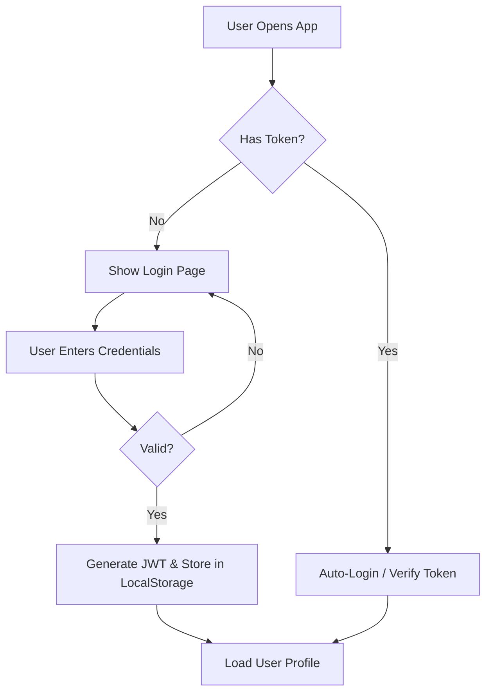

# Weather-Clip Application Workflow Map

This document outlines the detailed operational flows of the application, detailing how users interact with the system, how data moves through the architecture, and specifically how the Quantum-Meteorological Engine functions.

## 1. Authentication Flow (User Entry)

The application starts by ensuring the user is valid before accessing personalized features.



**Key Files:**
- `src/layouts/AuthLayout.tsx` (Wrapper)
- `src/pages/auth/Login.tsx` / `Signup.tsx`
- `server/server.js` (Endpoints `/auth/login`, `/auth/signup`)

---

## 2. Core Dashboard Flow (Main Lifecycle)

Once authenticated, the main dashboard (`Index.tsx`) takes over. This is the central hub of usage.

1.  **Mount:** `Index.tsx` mounts.
2.  **Initial Location Check:**
    -   Apps checks for `location` state.
    -   **Trigger:** `useEffect` calls `getUserLocation()` (via `weather-api.ts`).
3.  **Location Detection Strategy:**
    -   Attempt **Browser GPS** (High Accuracy).
    -   *If Fail/Timeout (5s)* -> **Fallback 1:** `ipapi.co` (City IP).
    -   *If Fail* -> **Fallback 2:** `ipwho.is` (City IP).
    -   *If Fail* -> **Fallback 3:** `geojs.io` (State IP).
    -   *If Fail* -> **Default:** Hyderabad Coordinates.
4.  **Reverse Geocoding:**
    -   Coordinates are sent to OpenStreetMap (Nominatim).
    -   Returns: "City, Country" name.
    -   Result displayed in Header.

**Key Files:**
- `src/pages/Index.tsx`
- `src/lib/weather-api.ts` (Logic Hub)

---

## 3. Data Fetching Workflow

Every time the location changes (via Auto-detect or Search), the following parallel data fetch occurs:

```text
Event: Location Update (Lat/Lon)
   │
   ├──> Fetch 1: Current Weather (Open-Meteo)
   │       └──> Temperature, Wind, Humidity, UV, etc.
   │
   ├──> Fetch 2: 7-Day Forecast (Open-Meteo)
   │       └──> Daily Highs/Lows, Rain probability
   │
   ├──> Fetch 3: Hourly Forecast (Open-Meteo)
   │       └──> Next 24 hours trend
```

**State Management:**
-   Loading state `true` -> Spinners appear.
-   Data returns -> State updates -> UI Re-renders.
-   Data is holding in local component state in `Index.tsx`.

---

## 4. User Interaction Workflows

### A. Search & Navigation
1.  **User Query:** Types "Paris" in `SearchBox`.
2.  **Autocomplete:**
    -   Debounced call to Geocoding API.
    -   Suggestions dropdown appears.
3.  **Selection:**
    -   User clicks suggestion.
    -   `location` state updates.
    -   **Triggers:** "Data Fetching Workflow" (See Section 3).
    -   Reverse Geocoding is skipped (we already have the name from the search result).

### B. User Profile Management
1.  **View:** Click Avatar -> Dropdown -> Profile.
2.  **Data:** Fetches user details (Name, Role, Join Date) from `server.js` (SQLite).
3.  **Location:** The Profile component runs its *own* location check (reusing the shared logic) to show where the user *physically* is, independent of the weather map location.

### C. Settings
1.  **Toggle:** Change Units (C -> F) or Theme (Dark -> Light).
2.  **Context Update:** `SettingsContext` updates global state.
3.  **Persistence:** Saves immediately to `localStorage`.
4.  **Reaction:** All components reading context re-render immediately to reflect changes.

---

## 5. Technical Stack & Data Flow

```text
[ FRONTEND (Vite / React) ]
       │
       │ (HTTP / REST)
       ▼
[ EXTERNAL APIs ] <───────> [ BACKEND (Node / Express) ]
 1. Open-Meteo (Weather)           │
 2. Nominatim (Maps)               │ (Better-SQLite3)
 3. IP Geolocation                 ▼
                           [ DATABASE (SQLite: app.db) ]
                             - Users
                             - Profiles
                             - Logs
```

**Security Notes:**
-   **API Keys:** None used (all Free Tier / Public APIs).
-   **Auth:** JWT Tokens passed in `Authorization: Bearer` header for backend requests.
-   **Validation:** Backend sanitizes inputs before SQL queries to prevent Injection.

---

## 6. External API Integration

The application relies on a mosaic of **free, public APIs** to function without requiring private keys.

### 1. Weather Data (Core)
*   **Provider:** [Open-Meteo](https://open-meteo.com/)
*   **Purpose:** The engine of the application.
*   **Endpoints Used:**
    *   `/v1/forecast`: Fetches current conditions, hourly data, and daily forecasts.
    *   `/v1/archive`: Fetches historical weather data for charts.
    *   `/v1/air-quality`: Fetches current and historical AQI data.
    *   `/v1/search` (Geocoding): Converts city names to Lat/Lon coordinates for search.

### 2. Maps & Reverse Geocoding
*   **Provider:** [OpenStreetMap (Nominatim)](https://nominatim.org/)
*   **Purpose:** Converting raw coordinates back into human-readable city names.
*   **Usage:**
    *   Called immediately after location detection to update the header (e.g., "17.38, 78.48" -> "Hyderabad, India").
    *   **User-Agent:** Required header `WeatherDashboard/1.0` is sent to comply with usage policies.

### 3. Localization (IP-to-Geo Fallbacks)
A robustness chain used when Browser GPS is denied or unavailable (e.g., on HTTP).

1.  **[ipapi.co](https://ipapi.co/)** (Priority 1)
    *   **Usage:** First fallback. Provides highly accurate city-level IP location (JSON format).
2.  **[ipwho.is](https://ipwho.is/)** (Priority 2)
    *   **Usage:** Secondary fallback. Excellent city-level accuracy and higher rate limits.
3.  **[geojs.io](https://get.geojs.io/)** (Priority 3)
    *   **Usage:** Final fallback. Reliable but sometimes less granular (State/Country level).

---

## 7. Quantum-Meteorological Intelligence Engine

This is the core differentiator of the system. It combines classical weather data with quantum state simulation to predict "Atmospheric Chaos" and risk probabilities.

### A. The Quantum Pipeline
1.  **Ingestion:** Real-time weather vectors (Temperature, Pressure, Wind, Humidity) are normalized into the range `[0, π]`.
2.  **Encoding:** These values are encoded as rotation angles on a 5-qubit quantum circuit.
    *   `q0`: Temperature
    *   `q1`: Humidity
    *   `q2`: Pressure
    *   `q3`: Wind Speed
    *   `q4`: Cloud Cover (Control qubit)
3.  **Entanglement:** A series of CNOT gates are applied to "entangle" these variables. This allows the system to model how a change in one variable (e.g., Pressure drop) quantum-mechanically affects another (e.g., Wind Speed increase), simulating the non-linear "Butterfly Effect".
4.  **Simulation:** The Qiskit engine runs a Statevector simulation to calculate the probability amplitude of all 32 outcomes ($2^5$).

### B. Derived Probabilistic Metrics (%)
The raw quantum state vector is collapsed into meaningful percentages for the user:

#### 1. Cyclone Formation Index (%)
*   **Calculation:** Based on the probability of high-energy, high-vorticity states (states where Wind and Pressure qubits correlate strongly).
*   **Representation:** Displayed as a percentage `0-100%`.
    *   `0-30%`: Stable
    *   `31-60%`: Watch
    *   `61%+`: Warning (High likelihood of cyclogenesis)

#### 2. Storm Warning Probability (%)
*   **Calculation:** derived from the superposition of 'Rain' and 'Wind' qubits. If the probability amplitude of the `|11...>` state (Rain=1, Wind=1) is dominant, the % rises.
*   **Representation:** A direct `0-100%` risk factor shown in the Disaster HUD.

#### 3. Chaos Acceleration (ψ/t²)
*   **Definition:** The second derivative of system entropy over time.
*   **Meaning:**
    *   **Positive (+):** The weather system is becoming *more* chaotic and less predictable (Destabilizing).
    *   **Negative (-):** The system is settling into a stable pattern.
*   **Workflow:** The backend compares the current entropy $S_{t}$ with previous logs ($S_{t-1}$, $S_{t-2}$) stored in SQLite to calculate acceleration.

#### 4. State Lock-In
*   **Status: FLUID vs LOCKED**
*   **Logic:** If a single quantum state achieves >85% probability dominance, the system is considered "LOCKED". This means the predicted outcome (e.g., a storm) is no longer probabilistic but mathematically inevitable based on current trends.

### C. Visual Data Flow
1.  **Dashboard:** Display Logic
    *   **Input:** User selects a city.
    *   **Processing:** Frontend waits for `WeatherData`.
    *   **Request:** `POST /weather/quantum-analyze` sent to Backend.
    *   **Response:** Backend returns JSON with `storm_probability`, `cyclone_index`, `chaos_velocity`.
    *   **Render:**
        *   **Quantum Core:** Shows the raw "bloch sphere" visualization.
        *   **Disaster HUD:** Updates the Progress bars and % text.
        *   **Metrics Grid:** Shows the "Chaos Acceleration" value.
